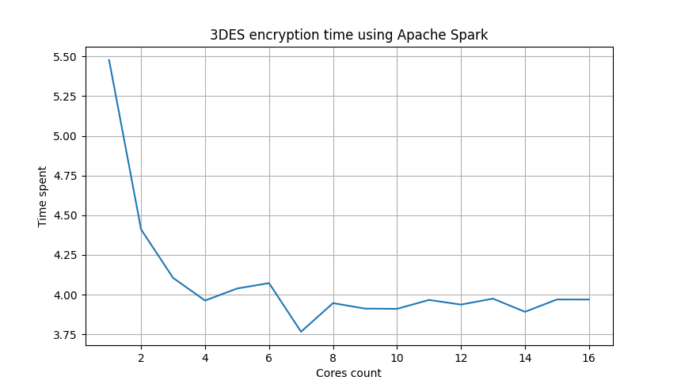
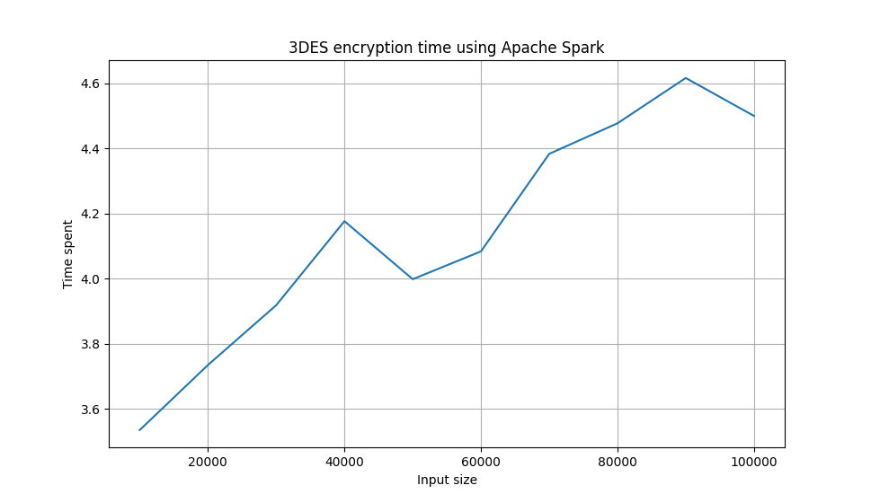

3DES encryption algorithm implemented using Apache Spark framework.

## Setup environment

Setup virtual environment for this Python project:

```sh
python3 -m venv .venv
source .venv/bin/activate
pip3 install -r requirements.txt
```

## Run 3DES encryption

Use `DESSpark.py` script to encrypt/decrypt input file:

```txt
# python3 DESSpark.py --help
usage: DESSpark [-h] [-c CORES] [-v VERBOSITY] -k KEY KEY KEY -m {enc,dec} INPUT OUTPUT

Compute 3DES algorithm using Apache Spark

positional arguments:
  INPUT                 Path to input file (- for STDIN)
  OUTPUT                Path to output file

options:
  -h, --help            show this help message and exit
  -c CORES, --cores CORES
                        Number of cores to compute on
  -v VERBOSITY, --verbosity VERBOSITY
                        Logs verbosity level
  -k KEY KEY KEY, --key KEY KEY KEY
                        Three hex-encoded integers representing 3DES key
  -m {enc,dec}, --mode {enc,dec}
                        Mode of 3DES algorithm (encrypt or decrypt)

Created as a part of PORR 2023 projects
```

## Run benchmarks

Use `benchmark.py` to validate and benchmark solution:

```
python3 benchmark.py --help
usage: benchmark.py [-h] {cores,inputSize,validate}

Benchmark tool for DESSpark.py prog

positional arguments:
  {cores,inputSize,validate}

options:
  -h, --help            show this help message and exit
```

Example output from available options:

```txt
python3 benchmark.py validate
Test success
```

```txt
python3 benchmark.py cores
```


```txt
python3 benchmark.py inputSize
```


